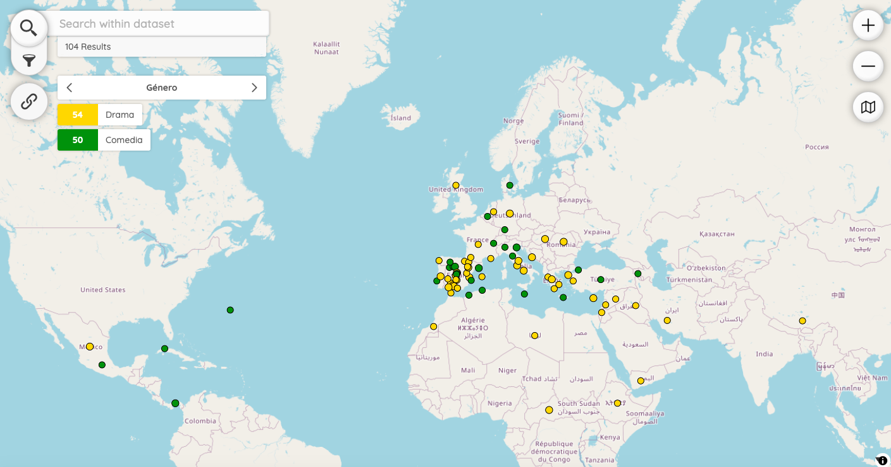

# Peripleo | El mundo de Lope de Vega

This map is part of the project El mundo de Lope de Vega (2024-2025). It shows the names of the places mentioned in different plays that make up the corpus of the _Comedia Nueva_. With this visualisation, users can search places and filter them by genre, subgenre and title of the plays.

Peripleo is a prototype application for the discovery and spatial visualisation of collection data, originally an initiative of the Pelagios Network and developed early in 2022 as part of the British Library's Locating a National Collection project (LaNC).

## LinkedPlaces Data

Our [LP-Format](https://github.com/LinkedPasts/linked-places-format) data can be found [here](https://github.com/MiguelBetti/Lope_peripleo/tree/main/public/data).

## Code Reuse

Our javascript implementation of Peripleo can be found [here](https://github.com/MiguelBetti/Lope_peripleo/tree/main/src). It is a slightly different version from the original Peripleo.

## Installation

See the *Peripleo* instructions for the visualisation of your own geospatial data:
1. the [Installation Guide](https://github.com/britishlibrary/peripleo/blob/main/README.md), and
2. the [Configuration Guide](https://github.com/britishlibrary/peripleo/blob/main/Configuration-Guide.md).
