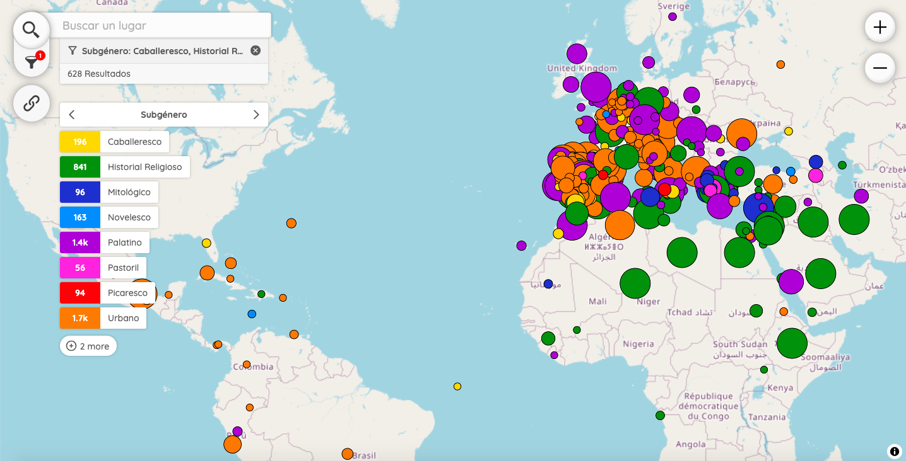

# Peripleo | El mundo de Lope de Vega 🌍

This [map](https://miguelbetti.github.io/Lope_peripleo/#/?/?/?/mode=points) is part of the project _El mundo de Lope de Vega_ (2024-2025). It shows the names of the places detected with machine learning in 378 plays. With this visualisation, users can search places and filter them by genre, subgenre, title, date, etc.

Peripleo is a prototype application for the discovery and spatial visualisation of collection data, originally an initiative of the Pelagios Network and developed early in 2022 as part of the British Library's Locating a National Collection project (LaNC).

## LinkedPlaces Data

Our [LP-Format](https://github.com/LinkedPasts/linked-places-format) data can be found [here](https://github.com/MiguelBetti/Lope_peripleo/tree/main/public/data). To extract the place names in our corpus we have developed our own [NER model](https://github.com/MiguelBetti/Lope_ner).

## Code Reuse

Our javascript implementation of Peripleo can be found [here](https://github.com/MiguelBetti/Lope_peripleo/tree/main/src). It is a slightly different version from the original Peripleo.

## Installation

See the *Peripleo* instructions for the visualisation of your own geospatial data:
1. the [Installation Guide](https://github.com/britishlibrary/peripleo/blob/main/README.md), and
2. the [Configuration Guide](https://github.com/britishlibrary/peripleo/blob/main/Configuration-Guide.md).
